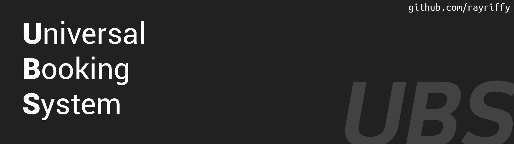

A ready-to-use booking system for laboratory.

## Preparing environment
- MySQL 5.7 or above (We recommend MariaDB for more security protection)
- PHP 5.5
- Apache 2

NOTE: Please be sure that your php.ini set `short_open_tag = On`

## How to install UBS?
- Download files from [GitHub/master](http://github.com/rayriffy/universal_booking_system)
- Place these files to your root directory
- Type URL to `startup.php`
- Follow setup instruction
- Enjoy

## Bugs? Suggestions?
Please open an issue
